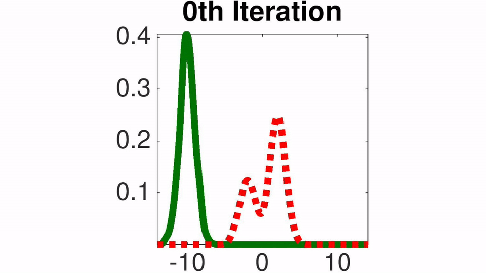

# Stein Variational Gradient Descent (SVGD)
SVGD is a general purpose variational inference algorithm that forms a natural counterpart of gradient descent for optimization. SVGD iteratively transports a set of particles to match with the target distribution, by applying a form of functional gradient descent that minimizes the KL divergence.

The package contains implementation of SVGD in both Matlab and Python language. Demos are also provided to reproduce the results in our paper. The Bayesian neural network example is based on Theano.

For more information, please visit our project website - [SVGD](http://www.cs.utexas.edu/~qlearning/project.html?p=vgd).

<!--
## A tensorflow-based implmentation and more examples & models: [tf-svgd](https://github.com/dilinwang820/SVGD)
-->

## Toy example on 1D Gaussian Mixture
Toy example with 1D Gaussian mixture. The red dashed lines are the target density function and the solid green lines are the densities of the particles at different iterations of our algorithm (estimated using kernel density estimator).



## Basic Usage
```python
'''
  x0: initial particles
  dlnprob: returns first order derivative of log probability
  n_iter: number of iterations
  stepsize: initial learning rate 
'''
theta = SVGD().update(x0, dlnprob, n_iter, stepsize)
```

## Citation
Qiang Liu and Dilin Wang. [Stein Variational Gradient Descent (SVGD): A General Purpose Bayesian Inference Algorithm](http://arxiv.org/abs/1608.04471). NIPS, 2016.

## Feedback
Feedback is greatly appreciated. If you have any questions, comments, issues or anything else really, [shoot me an email](mailto:dilin@cs.utexas.edu).

All rights reserved.
